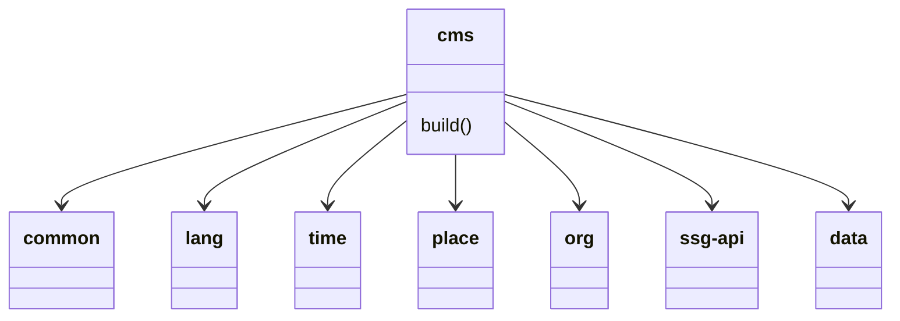

# RR0 CMS

This is the Content Management System (CMS) used to build the [RR0 website](https://rr0.org).

It allows to produce a similar website, but with the data of your choice.

It relies on [ssg-api](https://www.npmjs.com/package/ssg-api) to generate the web pages.

While it is especially designed to render UFO-related data as it was designed to render the  [RR0 website](https://rr0.org),
it can also probably be used to generate websites pertaining to other topics, as most of the data types (time, place, event, sources, notes, etc.) are not specific to the ufological domain. 

- [Data types](https://github.com/RR0/data?tab=readme-ov-file#rr0data)
