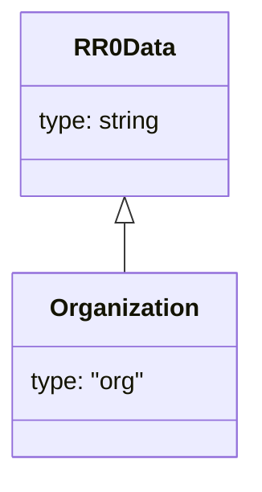
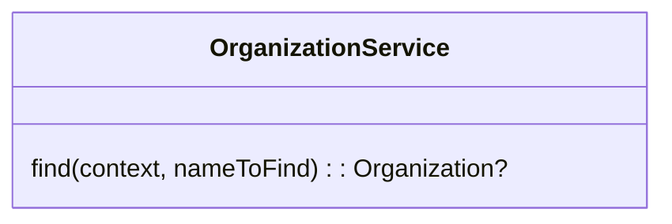

# RR0 CMS organizations API

## Data types

An [Organization](./CmsOrganization.ts) is a type of RR0 [data](../data/README.md).

```mermaid
classDiagram
    class RR0Data {
        type: string
    }
    class Organization {
        type: "org"
    }
    RR0Data <|-- Organization
```

## Services

[OrganizationService](./OrganizationService.ts)

```mermaid
classDiagram
    class OrganizationService {
        find(context, nameToFind): Organization?
    }
```
