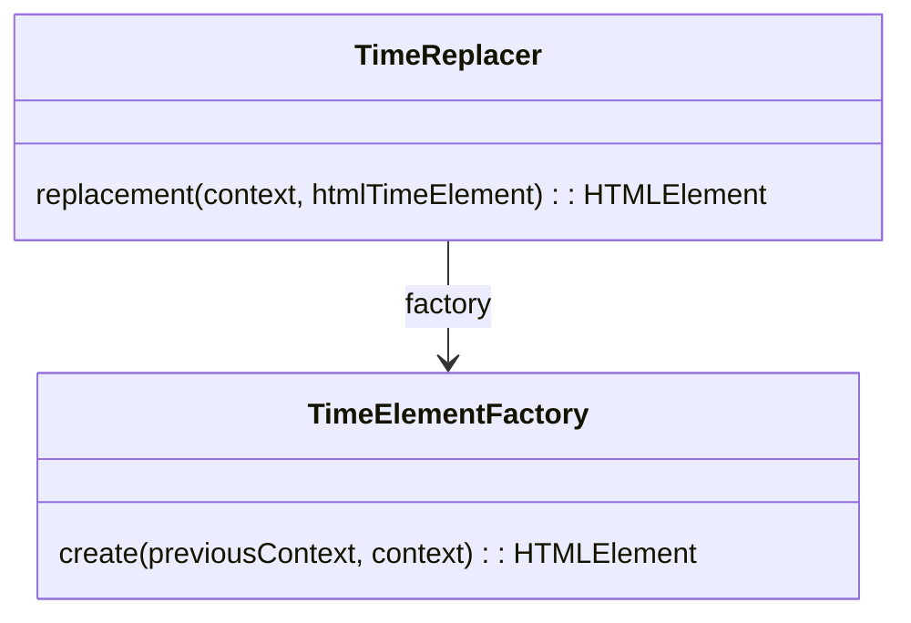
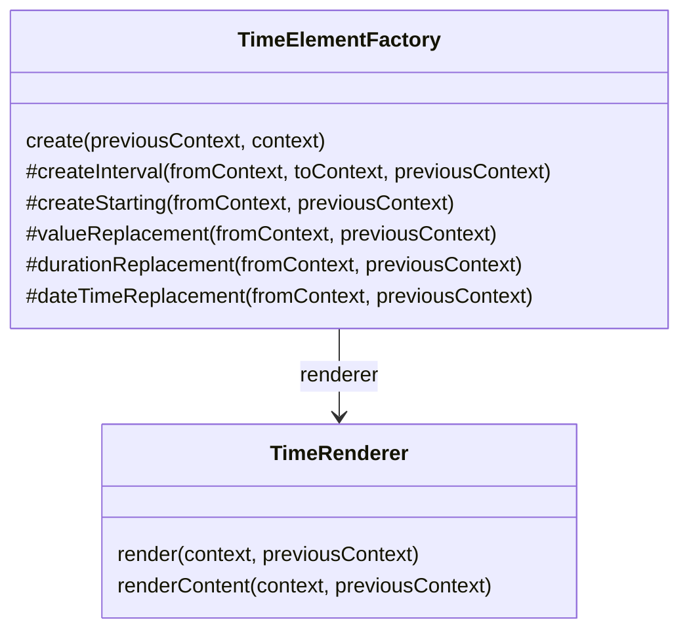
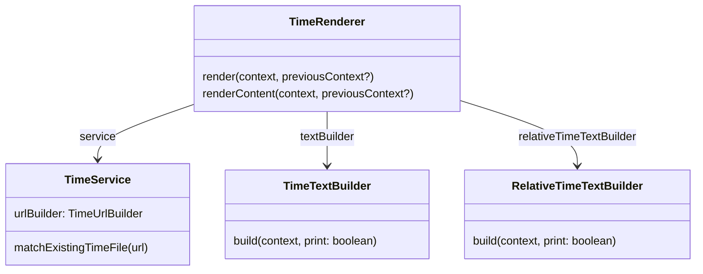

# RR0 CMS Time HTML rendering API

This API allows to render time as HTML in absolute or relative ways.

It relies on [**@ssg-api**](https://www.npmjs.com/package/ssg-api) to perform replacements in HTML pages/templates.

HTML support here is about replacing `<time>` tags:

- **dates** like `<time>1972-08-12</time>` with links toward an existing page about this time.
- date **intervals** (open or not) like `<time>1972/1974</time>` with a couple of links as above.
- **durations** like `<time>P2H3M</time>` with resolved duration texts.

The [`TimeReplacer`](html/TimeReplacer.ts) is a [**@ssg-api**](https://www.npmjs.com/package/ssg-api) replacer to for `<time>` tags that calls
the [TimeElementFactory](#TimeElementFactory) to create proper replacements depending on the detected contexts:

## TimeElementFactory

The [`TimeElementFactory`](html/TimeElementFactory.ts) will ask [@rr0/time](https://www.npmjs.com/package/@rr0/time) to parse the `<time>` tag contents to either create an element rendering:

- an HTML interval, either:
    - closed (`createInterval()` building an element like "between x and y") or
    - open (`createStarting()` building an element like "starting x")
- a date (fuzzy or not) `valueReplacement()` building en element like

Depending on those cases, it will call the [`TimeRenderer`](#TimeRenderer) with different parameters.

## TimeRenderer

The [TimeRenderer](html/TimeRenderer.ts) is responsible for `render`ing the actual HTML elements for given `TimeContext`s.

To do so, it creates elements and put inside time-related text generated by a [`TimeTextBuilder`](#TimeTextBuilder).
If a `previousContext` was provided, a *relative* rendering will be performed by a `RelativeTimeBuilder` to provide a time expression *relative* to it.

