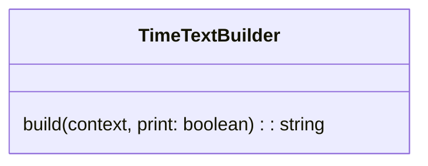
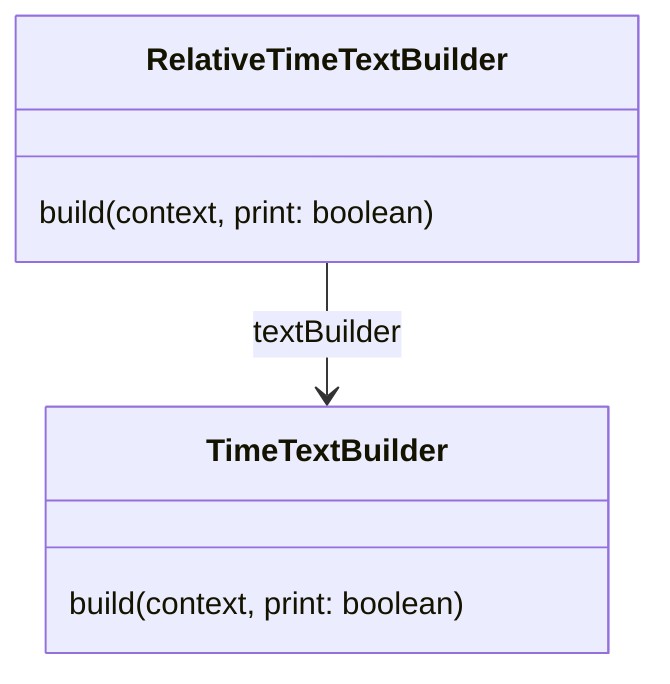

# RR0 CMS Time text rendering

This API allows to render `TimeContext` as text, in absolute or relative ways.

## TimeTextBuilder

The [*TimeTextBuilder*](text/TimeTextBuilder.ts) aims to build text representation of a `TimeContext`.

## RelativeTimeTextBuilder

The [*RelativeTimeTextBuilder*](text/RelativeTimeTextBuilder.ts) aims to build text representation of a `TimeContext`
*relatively* to another. This allows to build text such as "next year" instead of "in 2006" if the previous context provided was about 2005.

